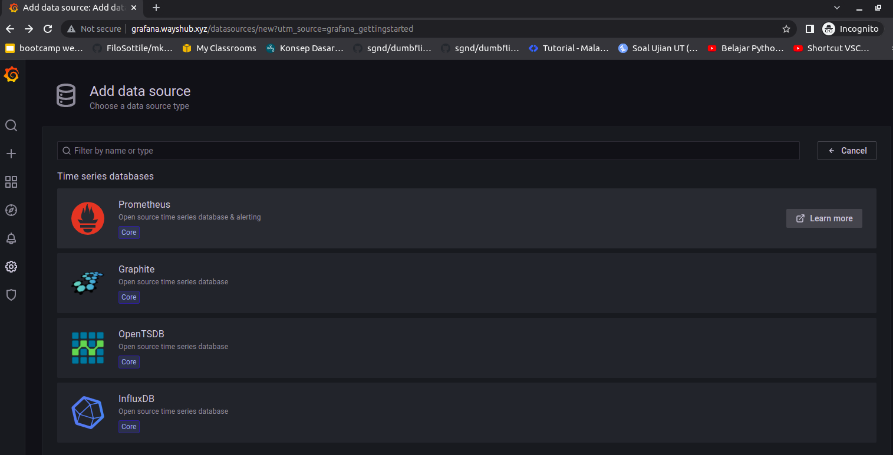
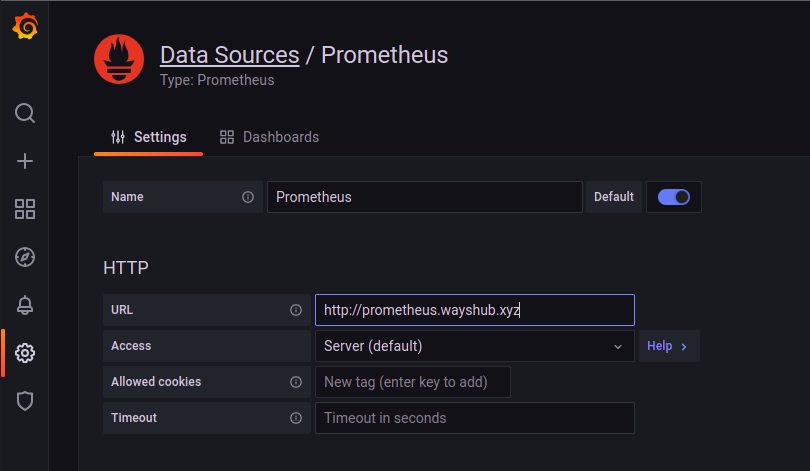
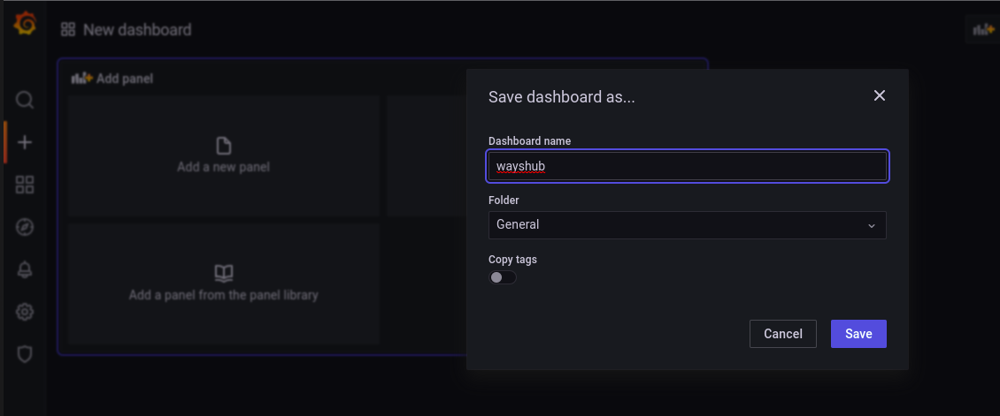
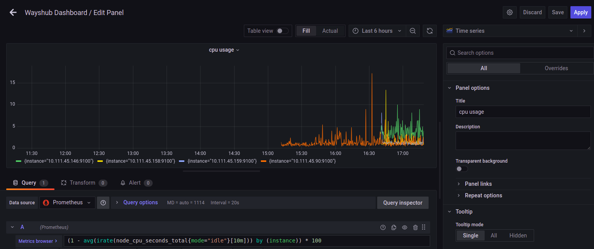
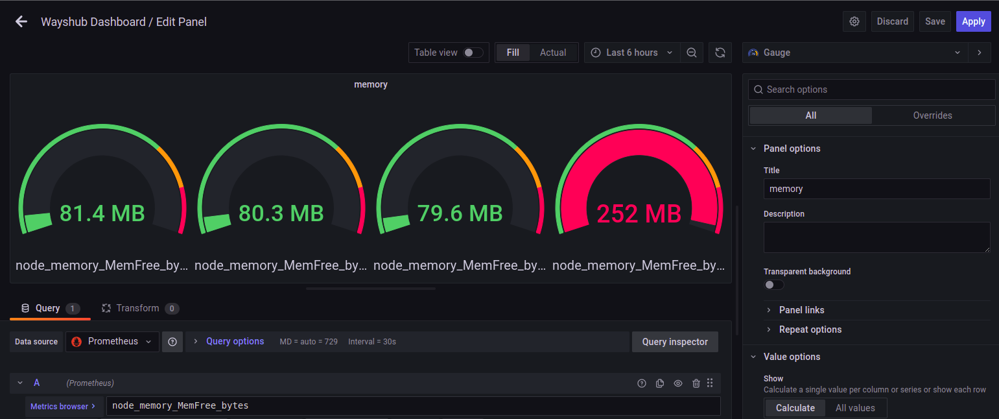
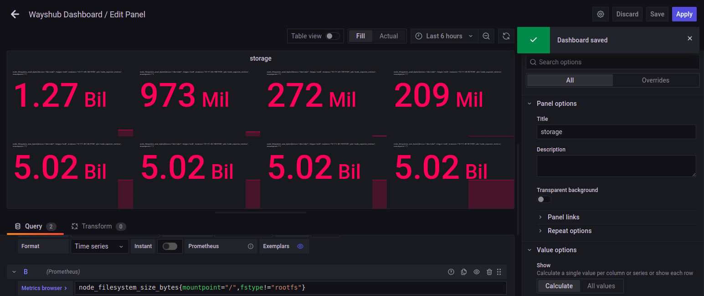
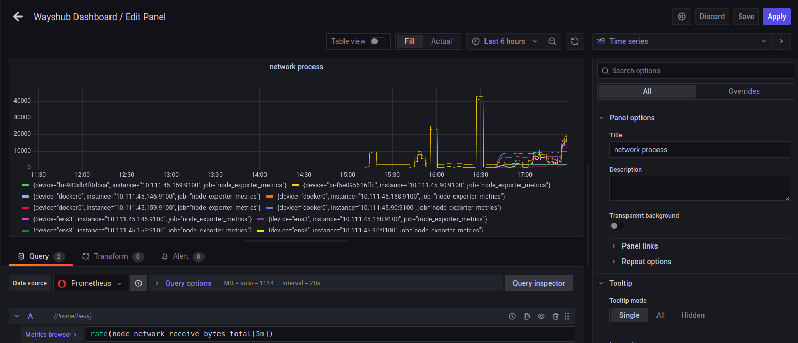
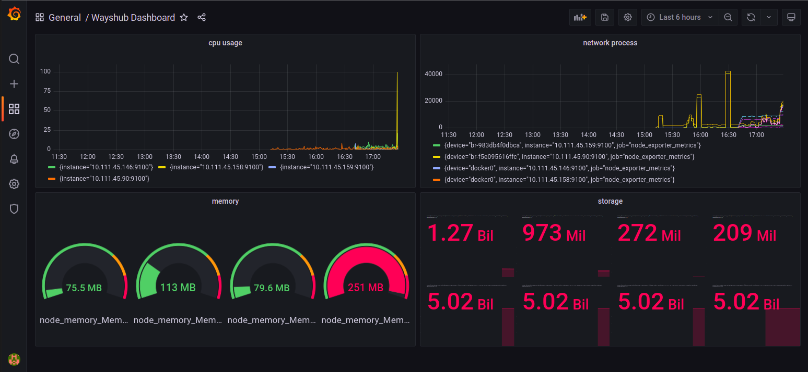

# **CONNECT MULTIPLE SERVER TO PROMETHEUS**

## Menampilkan CPU, Memory Process, Storgae and Network Process menggunakan Grafana

1. Login ke browser `grafana.wayshub.xyz` dan login.
2. Pada bagian configuration tambahkan data source dari prometheus.  
     

3. Pada halaman setting grafana prometheus masukkan URL prometheus, kemudian save.  
     

4. Buat dashboard baru untuk menyimpan panel-panel monitoring.  
     

## Buat panel untuk cpu usage
1. Add new panel.
2. Pada bagian query, copy rumus berikut untuk menampilkan cpu usage `(1 - avg(irate(node_cpu_seconds_total{mode="idle"}[10m])) by (instance)) * 100`.
3. Setelah itu graph akan terupdate jika berhasil.
4. Beri nama pada panel kemudian simpan.
     

## Buat panel untuk memory usage
1. Add new panel.
2. Pada bagian Query, cari dan set di Metric Browser `node_memory_MemFree_bytes`.
3. Di bagian panel cari standard options. Pilih Unit `bytes(SI)`.
4. Pilih graph type Gauge.  
     

## Buat panel untuk storgage
1. Add new panel.
2. Pada bagian Query, cari dan set di Metric Browser untuk menampilkan available storage `node_filesystem_avail_bytes{mountpoint="/",fstype!="rootfs"}`.
3. Tambahkan query lagi untuk menampilkan size storage `node_filesystem_size_bytes{mountpoint="/",fstype!="rootfs"}`
4. Di bagian panel cari standard options. pilih unit bytes(SI).
5. Pilih graph type Stat.  
     

## Buat panel untuk network process
1. Add new panel kemudian edit.
2. Pada bagian Query, cari dan set di Metric Browser untuk menampilkan storage `node_network_receive_bytes_total`.
3. Tambahkan function rate() `rate(node_network_receive_bytes_total[5m])`
4. Add query baru, cari metric `node_network_transmit_bytes_total` di Metric Browser
5. Tambahkan function rate() `rate(node_network_transmit_bytes_total[5m])`.
6. Klik `Apply`.  
     

## Tampilan Dashboard

