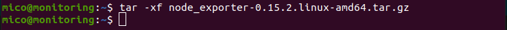
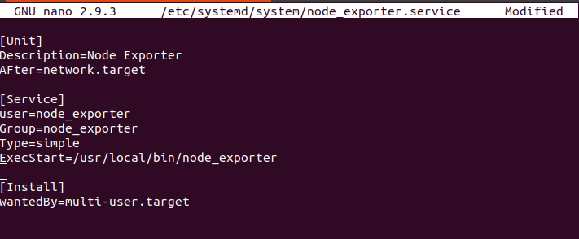
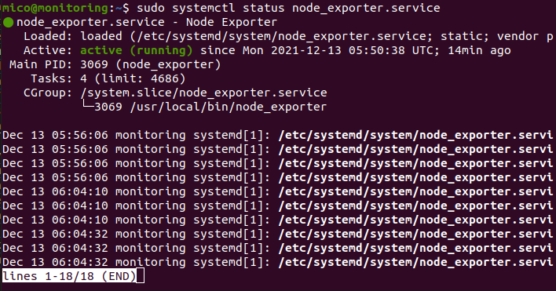
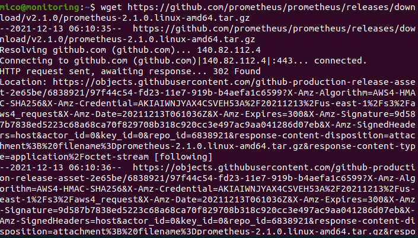
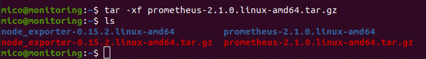
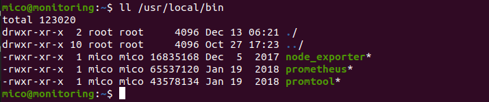
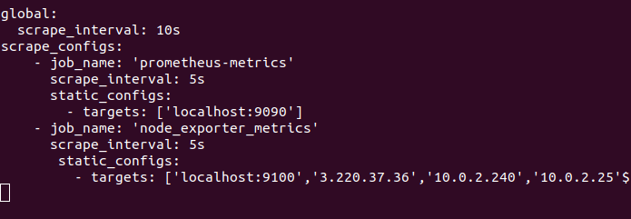

# **SETUP MONITORING SERVER**

1. Buat instance baru di AWS.
2. Set instance type t2.medium.
3. Set 16 Gb untuk storagenya.
4. Set secutity group dan launch instance.   

## Install Node Exporter di Server

1. Download node exporter.

        wget https://github.com/prometheus/node_exporter/releases/download/v0.15.2/node_exporter-0.15.2.linux-amd64.tar.gz
      

2. Extract zip hasil download.

        tar -xf node_exporter-0.15.2.linux-amd64.tar.gz
      

3. Pindahkan hasil extract ke `/usr/local/bin` dengan perintah `sudo mv node_exporter-0.15.2.linux-amd64/node_exporter /usr/local/bin`
4. Tambahkan user node_exporter dengan perintah `sudo useradd -rs /bin/false node_exporter`
5. Buat Service node_exporter dengan perintah `sudo nano /etc/systemd/system/node_exporter.service`.  
     

6. Save kemudian reload dengan perintah `sudo systemctl daemon-reload`.
7. Enable service dengan perintah `sudo systemctl enable node_exporter`.
8. Start node exporter dengan perintah `sudo systemctl start node_exporter`.
9. Cek status node exporter dengan perintah `sudo systemctl status node_exporter.service`.  
       

## Install Prometheus di Monitoring Server

1. Download Promotheus.

        wget https://github.com/prometheus/prometheus/releases/download/v2.1.0/prometheus-2.1.0.linux-amd64.tar.gz
      

2. Extract hasil download.
   
        tar -xf prometheus-2.1.0.linux-amd64.tar.gz
      

3. Pindahkan folder prometheus dan promtool ke `usr/local/bin` dengan perintah `sudo mv prometheus promtool /usr/local/bin`.  
     

4. Buat folder prometheus di /etc/ dan /var/lib

        sudo mkdir /etc/prometheus /var/lib/prometheus

5. Pindahkan folder dan console_library ke `/etc/prometheus` dengan perintah `sudo mv consoles console_libraries /etc/prometheus`.
6. Buat file .yml untuk monitoring server dengan perintah `sudo nano /etc/prometheus/prometheus.yml`.
     

7. 
   