# **SETUP SERVER WITH ANSIBLE**

## **Requirements**
- Buatlah repository di github untuk menyimpan file-file ansible.

## **Install Ansible in Ubuntu**

1. Konfigurasi PPA.

        sudo apt update
        sudo apt install software-properties-common
        sudo add-apt-repository --yes --update ppa:ansible/ansible

2. Kemudian install apt ansible.  
   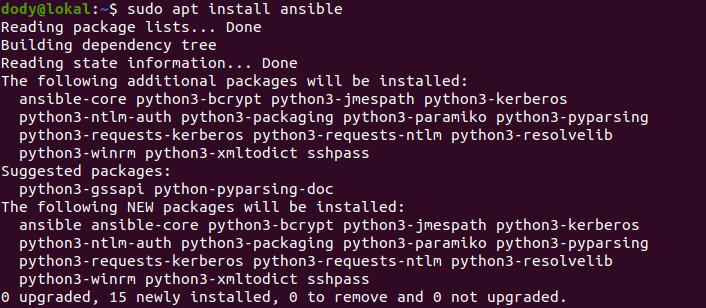  

## **Define Host Server**

1. Buat directory ansible dan buat hosts untuk menyimpan konfigurasi host.  
   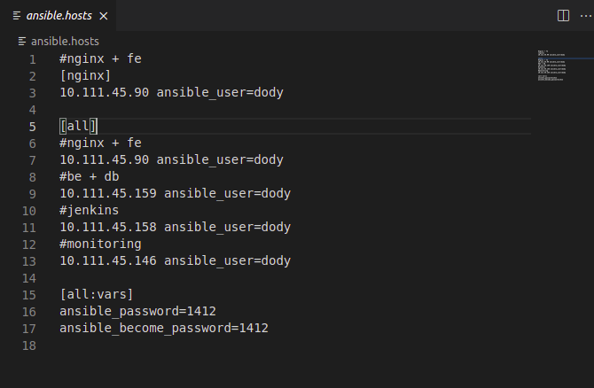  
   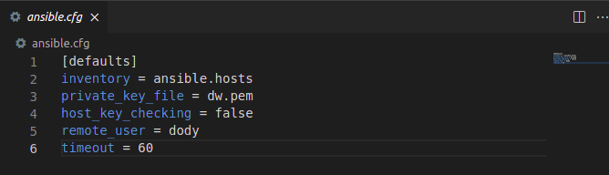  

2. Kemudian cek ping dengan perintah berikut.

        ansible all -m ping
    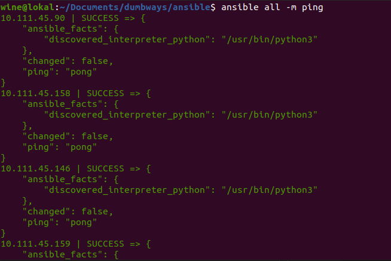  

## **Setup User**

1. Disini saya menggunakkan ansible-playbook.
2. Siapkan konfigurasi untuk membuat user.  
   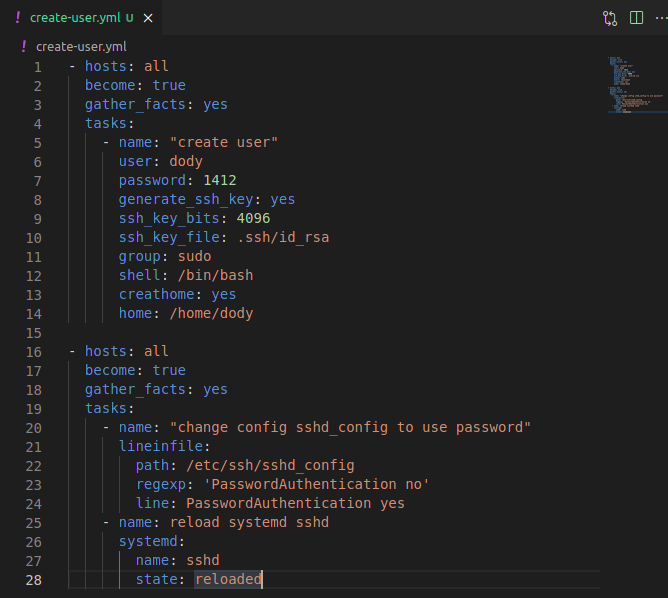  

## **Setup Nginx**

1. Siapkan konfigurasi untuk nginx dan kemudian jalankan `ansible-playbook nginx.yml`.  
   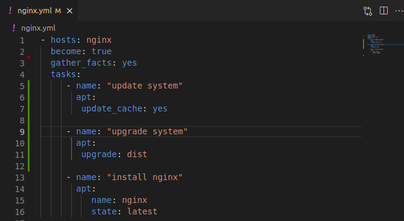  
   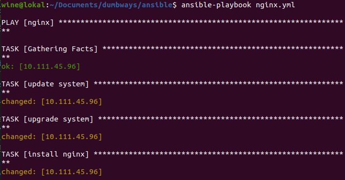  

2. Buka browser dan jalankan.  
   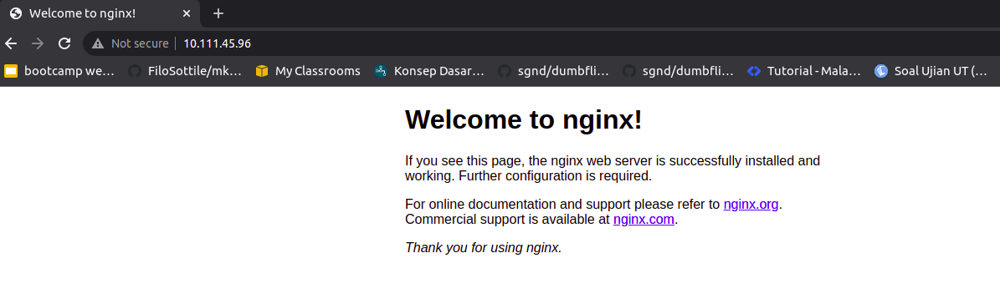  
   

## **Setup CICD**

1. Siapkan konfigurasi untuk jenkins dan kemudian jalankan `nsible-playbook jenkins.yml`.  
   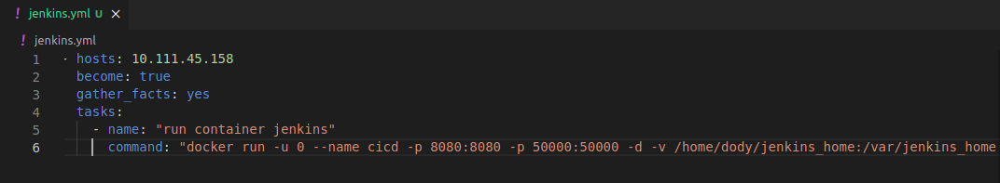  
   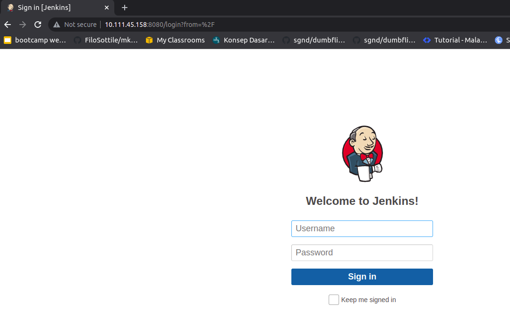  
   
## **Setup Database**

1. Siapkan konfigurasi untuk database dan kemudian jalankan `ansible-playbook database.yml`.  
   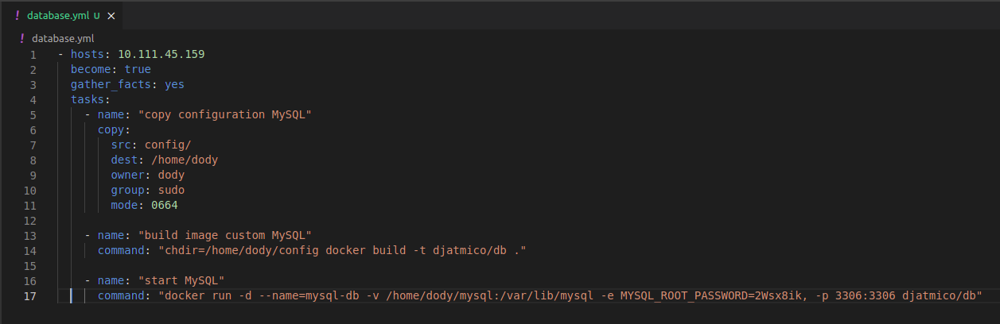  

## **Setup Backend**

1. siapkan konfigurasi untuk backend dan kemudian jalankan `ansible-playbook backend.yml`.  
   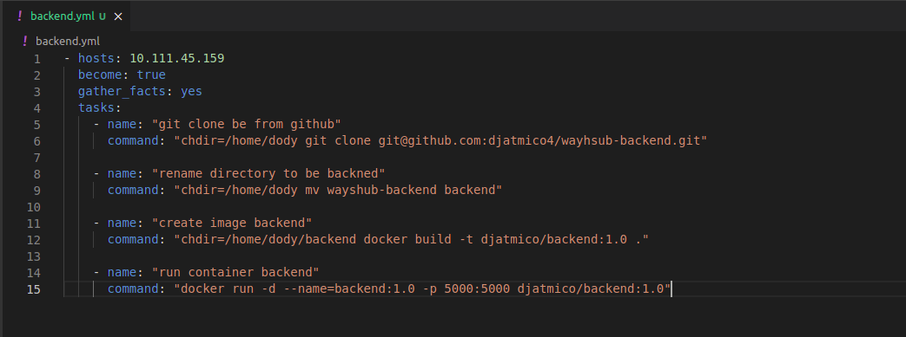  
   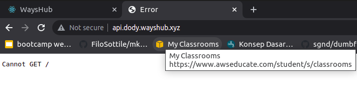  

## **Setup Frontend**

1. siapkan konfigurasi untuk frontend dan kemudian jalankan `ansible-playbook frontend.yml`.  
   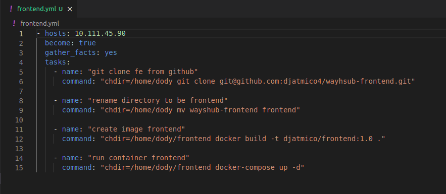  
   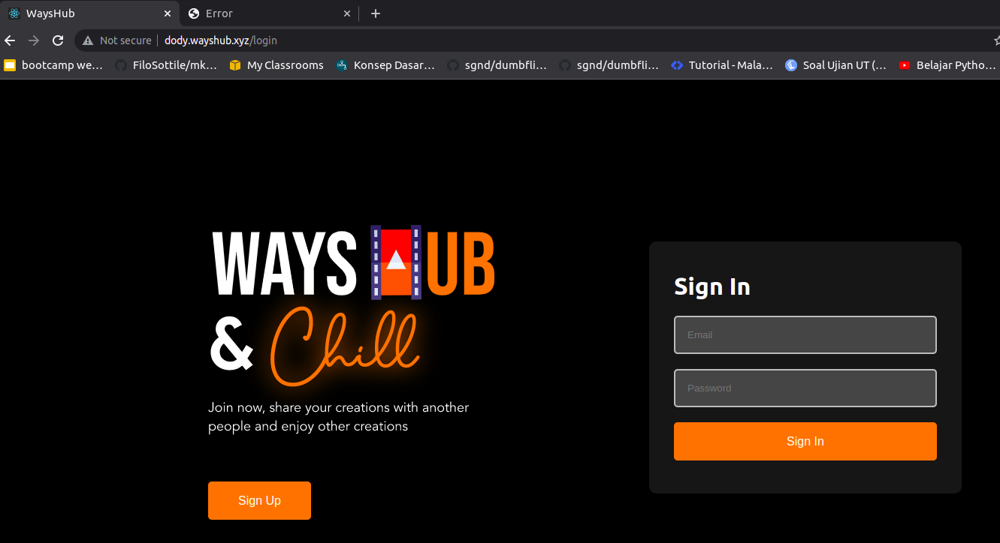 
